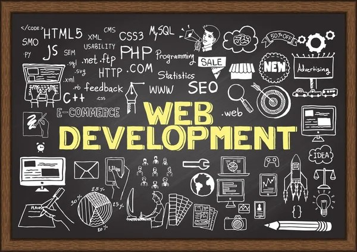

<h1 align="center">👋 Hey there, I'm Abu Talib</h1>
<h3 align="center">💻 Full Stack Web Developer | UI/UX Enthusiast | Creative Coder</h3>

---

### 🚀 About Me

I'm **Syed Abu Talib**, a passionate **Full Stack Developer** with a strong eye for design and modern UI/UX trends.  
Since **2022**, I’ve been crafting beautiful, high-performing, and scalable web applications using cutting-edge technologies.  

I love turning ideas into interactive, real-world products — blending clean design, smooth animations, and optimized code.  
When I’m not coding, you’ll find me experimenting with 3D visuals, motion design, or exploring new web frameworks.

🎓 Studying *Media-Based Computer Science* at **Ziauddin University**  
🧠 Constantly learning and exploring **React**, **Laravel**, **Next.js**, and **GSAP animations**  
💡 Fun fact: I enjoy creating elegant animations that bring interfaces to life!  

---

### 🛠️ Tech Stack

#### 💻 Frontend

#### ⚙️ Backend

#### 🎨 Design Tools

#### 🧰 Other Tools

---

### 🌟 GitHub Stats & Animations

  

---

### ✨ Random Dev Quote

---

### 🐍 GitHub Contribution Snake

<picture>
  <source media="(prefers-color-scheme: dark)" srcset="https://raw.githubusercontent.com/tobiasmeyhoefer/tobiasmeyhoefer/output/github-snake-dark.svg" />
  <source media="(prefers-color-scheme: light)" srcset="https://raw.githubusercontent.com/tobiasmeyhoefer/tobiasmeyhoefer/output/github-snake.svg" />
  
</picture>

---

### 🌐 Connect With Me

---

### 🪄 “Code. Design. Animate. Repeat.” ✨
